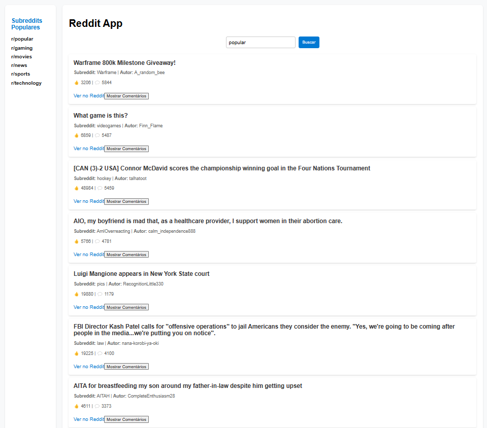

# 🚀 Reddit App - Cliente de Reddit com React + Redux

Este é um aplicativo web que permite pesquisar posts do Reddit, visualizar os detalhes e explorar subreddits populares.

## 🎨 Tecnologias Utilizadas

- **React + TypeScript**
- **Redux Toolkit**
- **SCSS**
- **Axios**
- **Reddit API**

## 📸 Capturas de Tela



## 📌 Funcionalidades

- ✅ Pesquisar posts de qualquer subreddit  
- ✅ Exibir comentários ao clicar em um post  
- ✅ Navegar entre subreddits populares  
- ✅ Interface moderna e responsiva  

## 🚀 Como Rodar o Projeto

1. Clone o repositório:
   ```sh
   git clone https://github.com/seu-usuario/reddit-app.git
   cd reddit-app

## 🚀 Como Rodar o Projeto

1. Clone o repositório:
  ```sh
  git clone https://github.com/seu-usuario/reddit-app.git
  cd reddit-app
  ```

2. Instale as dependências:
  ```sh
  npm install
  ```

3. Inicie o servidor de desenvolvimento:
  ```sh
  npm start
  ```

4. Abra o navegador e acesse:
  ```
  http://localhost:3000
  ```

## 🤝 Contribuindo

1. Faça um fork do projeto
2. Crie uma branch para sua feature (`git checkout -b feature/nova-feature`)
3. Commit suas mudanças (`git commit -m 'Adiciona nova feature'`)
4. Faça o push para a branch (`git push origin feature/nova-feature`)
5. Abra um Pull Request

## 📄 Licença

Este projeto está licenciado sob a Licença MIT - veja o arquivo [LICENSE](LICENSE) para mais detalhes.
